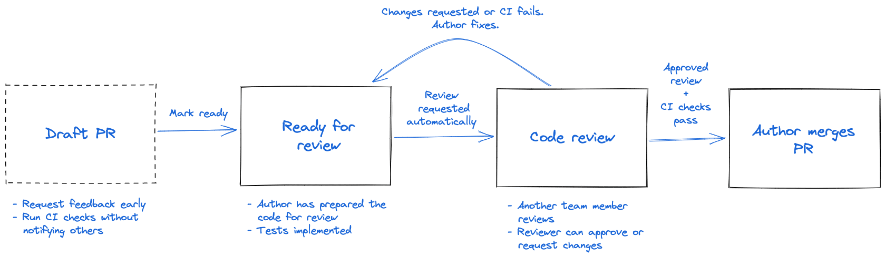

# Introduction to Code Reviews:

Code reviews are a critical aspect of the software development process, involving the inspection of code changes made by one team member before they are merged into the main codebase. This collaborative practice not only helps in identifying bugs but also significantly contributes to enhancing code quality, ensuring consistency across the codebase, and promoting knowledge sharing among team members. Through code reviews, developers can offer constructive feedback, mentorship, and learning opportunities, ultimately leading to the creation of robust and maintainable software systems.

## Guidelines for Effective Code Reviews:

**<u>Set Clear Objectives:</u>**
 - It's essential to establish clear objectives for code reviews, which may include ensuring functionality, maintainability, security, or adherence to coding standards. By defining these goals upfront, both the reviewer and the author have a clear understanding of what aspects of the code need to be focused on during the review process.

**<u>Regular Reviews:</u>**
- Incorporating code reviews as a regular part of the development process is crucial for maintaining code quality and catching issues early on. Ideally, code reviews should occur before merging code into the main branch, ensuring that any potential problems are addressed before they impact the larger codebase.

**<u>Create a Code Review Checklist</u>**
- A code review checklist is a predetermined set of questions and rules your team will follow during the code review process, giving you the benefit of a structured approach to necessary quality checks before you approve code into the codebase. Your checklist may include: 

**<u>Test Maintainability</u>**
- Over time, you may have to expand or change your code, so ensuring it’s easy to maintain and adjust will save you a few headaches. 

- Ask yourself these questions to assess maintainability:

  1. Is the code easy to test and debug?

  2. Can you configure the code to quickly change data values?

### Common Pitfalls to Avoid:
**<u> Nitpicking </u>** 

While it's essential to maintain code quality, overly nitpicking minor style issues can detract from the primary focus of the review and lead to frustration for both the author and the reviewer. It's crucial to prioritise feedback on issues that significantly impact code quality or functionality.

**<u>Lack of Ownership </u>** 

Both the author and the reviewer should take ownership of the code changes and follow through on addressing feedback. Without a sense of ownership, there may be a tendency to overlook or dismiss valuable suggestions for improvement.

### References

https://onlinelibrary.wiley.com/doi/10.1111/jeb.14230

https://www.win.tue.nl/~aserebre/CSCW2023.pdf

https://www.pluralsight.com/blog/software-development/code-review-checklist

https://www.atlassian.com/blog/add-ons/code-review-best-practices

https://dev.to/kimmobrunfeldt/16-best-practices-to-make-your-code-reviews-better-4m09

