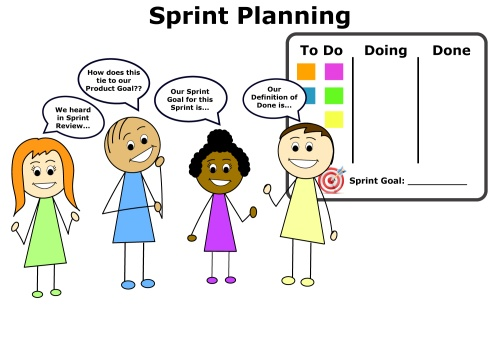

# Effective Sprint Planning

## What is Sprint Planning?
Sprint Planning is a crucial event in Scrum that kicks off the sprint. Its main objectives are to define what the sprint will deliver and outline how the team will achieve these deliverables. This event hinges on three essential components: setting a sprint goal, understanding the team’s capacity, and prioritizing backlog items. Effective sprint planning aligns the team's efforts, sets clear expectations, and lays the foundations for a successful sprint by focusing on what's most important and achievable.

## Insights from Resources
**<u>Estimation Techniques</u>**: Dive deeper into how teams can use various techniques to estimate work more accurately, such as time-based estimation, story points, and planning poker. Expanding on the concept of aligning team capabilities and organizing backlog tasks, this discussion introduces techniques to accurately measure the required effort and duration for specific activities.

**<u>Collaboration and Communication</u>**: Highlight the importance of effective communication and collaboration during the sprint planning process. Emphasize how open dialogue, active participation and ensuring that all team members have a voice in the planning process can lead to more engaged teams and better-planned sprints.

### References
https://www.atlassian.com/agile/scrum/sprint-planning

https://www.easyagile.com/blog/agile-sprint-planning/

https://blog.logrocket.com/product-management/what-is-sprint-planning/
