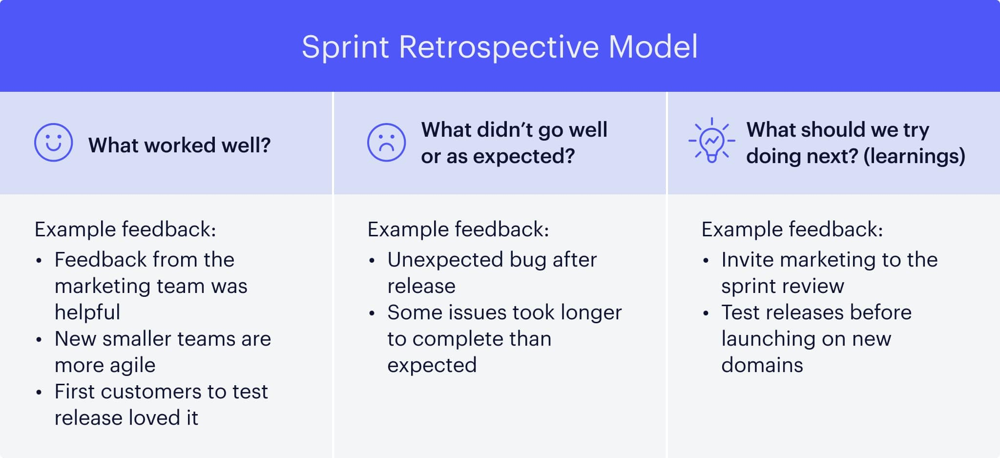

# What is a Sprint Retrospective?
The Sprint Retrospective concludes each sprint, offering the team an opportunity to reflect on the sprint that has just ended. The aim of the retrospective is to highlight what worked well and identify challenges faced, encouraging a culture of continuous improvement. By discussing these aspects, the team pinpoints areas for improvement and agrees on actionable steps to enhance future sprints.

## Insights from Resources
**<u>Leveraging Tools and Technologies</u>**: Emphasize the importance of using digital tools and platforms to facilitate more effective and inclusive retrospectives, especially for remote teams. Using these tools can enhance collaboration, allowing team members to contribute equally regardless of their location

**<u>Reflective Learning and Team Bonding</u>**: Highlight the retrospective's role is not just a process done as part of scrum but helps the team. Reflecting on the shared experiences and learnings as a team can help strengthen team cohesion and foster a culture of mutual respect and support.

## Best Practices and Guidelines
- Encouraging Open Communication: Tips for creating a safe space where team members feel comfortable sharing feedback.

- Identifying and Prioritizing Improvements: Strategies for narrowing down feedback to actionable items that the team can realistically implement.

- Follow-through on Action Items: Emphasize the importance of assigning responsibility for improvement actions and reviewing their progress in subsequent sprints.

## Common Pitfalls to Avoid
- Skipping retrospectives or not taking them seriously. 
- Allowing the retrospective to become a blame game instead of a constructive feedback session. 
- Failing to implement agreed-upon improvements.

### References
https://www.atlassian.com/team-playbook/plays/retrospective

https://miro.com/blog/resources/visual-collaboration-agile-development-guide/sprint-retrospective/

https://www.projectmanager.com/blog/effective-sprint-retrospective

https://www.scrum.org/resources/what-is-a-sprint-retrospective

https://blog.logrocket.com/product-management/what-is-a-sprint-retrospective-agile/