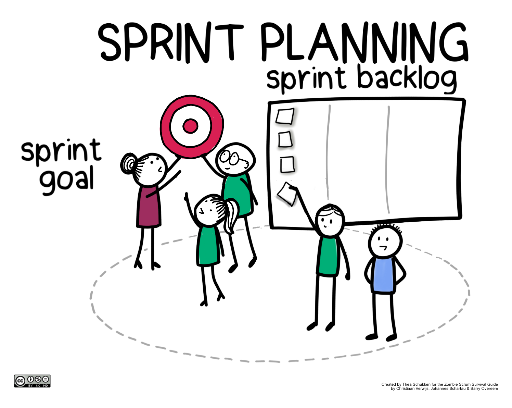

# Task Estimation in Scrum

## Key Concepts:
**<u>Sprint Planning:</u>**

This is a crucial part in a scrum meeting as this is where the team collaborates and determines which tasks can be done in the current sprint.

 - Estimation based on available resources and time.

 - Enhances communication and teamwork skills.

- Importance highlighted by setting clear goals and fostering collaboration.

**<u>User Stories:</u>**

User Stories provides an informal, natural language description of a feature of the software or product from the end-user perspective.

- Informal, natural language descriptions of software features from the end-user perspective.
- Improves transparency and ensures delivery of highest value.
- Prevents confusion by providing clear task descriptions.

According to numerous articles that I have read sprint planning sets clear defined goals, fosters communication, and promotes collaboration, while user stories are crucial for transparency and delivering the highest value, as they provide clear and concise task descriptions, preventing confusion within the team.